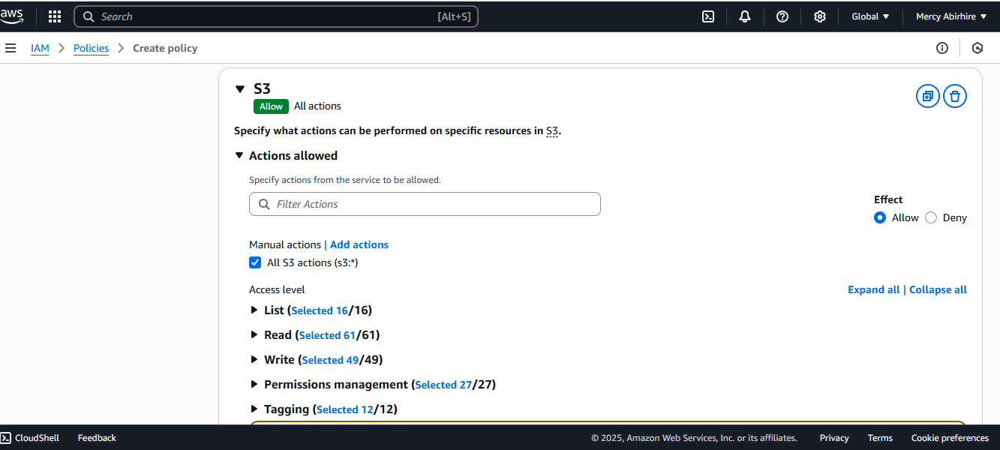
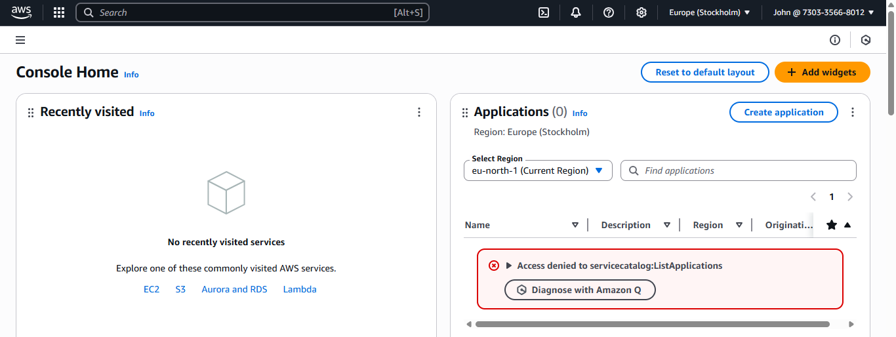
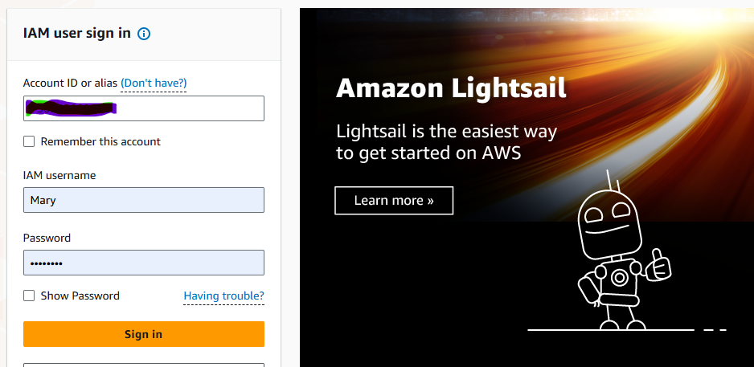

# zappy-e-bank

Zappy e-Bank is a fintech startup company looking to use the innovations in Cloud Computing Scurity and AWS Identity Management (IAM) to build, scale, and deliver financial services to its customers.

## Importance AWS IAM(Identity Management)

This is a fundamental security pillar that enables the startup to build, operate, and scale its financial services securely, compliantly, and efficiently in the cloud. The following can be achieved with IAM

* Create and manage AWS users and groups, to control access to AWS services and resources securely.

* Use IAM roles and policies to set more granular permissions for AWS services and external users or services that need to access Zappy e-Bank' AWS resources.

* Implement strong access controls, including multi-factor authentication (MFA), to enhance security.

## Project Setup

1. Log in to the AWS Management Console and navigate to the IAM dashboard

2. Create Policies, Associate the policies to their groups and Add Users to the groups.

2.1 Create policies for the Development Team

* In the IAM console, click on policies

* Click on create policy

* In the select a service section, search for ec2

* For simplicity sake, select the "ALL EC2 actions" checkbox

* Also, make sure to select "All" in the Resources section and Click Next.

* Provide the name developers and description for the policy.

* Click on Create Policy

After creating the policy, if you search for "developers" in the search box, you will notice that a number of policies are returned. This highlights the presence of both AWS managed that are generic and customer managed policies that are fully controlled by you, allowing for more tailored, specific access controls that can be finely tuned to your firm's requirements.

2.2 Create policy for the Data Analyst team

Repeat the process above for the Data Analysts team, but instead of EC2, search for S3. Also name the policy analyst instead of developers. 

* In the IAM console, click on policies

* Click on create policy

* In the select a service section, search for S3.

* For simplicity sake, select the "ALL EC2 actions" checkbox

* Also, make sure to select "All" in the Resources section and Click Next.

* Provide the name analyst and description for the policy.

* Click on Create Policy

After creating the policy, if you search for "developers" in the search box, you will notice that a number of policies are returned. This highlights the presence of both AWS managed that are generic and customer managed policies that are fully controlled by you, allowing for more tailored, specific access controls that can be finely tuned to your firm's requirements.

2.3. Create Group for the Development team

* In the IAM console navigation, select User group and in the top right click Create group

* Provide a name for the group
 

* Attach the developer policy we created earlier to the group. This will allow any user in the Development-Team group to have access to EC2 instances alone.

* You have successfully created a group and attached a permission policy for any user added to the group to have access to the EC2 instance only. Recall that users in this group will be backend developers only.

2.4. Create Group for the Data Analysts team

* In the IAM console navigation, select User group and in the top right click Create group

* Provide a name for the group
 

* Attach the developer policy we created earlier to the group. This will allow any user in the Analysts-Team group to have access to S3 instances alone.

* You have successfully created a group and attached a permission policy for any user added to the group to have access to the S3 instance only. Recall that users in this group will be data analysts only.

2.4. Creating IAM User for John

Since John is a backend developer, there is need to add him as a user to the Development-Team group

Navigate to the IAM dashboard, select "Users" and then click "Create user".

* Provide the name of the user. In this case "John"
Ensure that the user can access the AWS Management Console. If this is not selected, the user will not be able to login from the web.

* Permissions: Add the John to the development team group.

* Click on Create user

![Review and Create]
(img/image24.png)

* Download the login credentials for John

2.5. Creating IAM User for Mary

Since Mary is a data analysts, there is need to add her as a user to the Analysts-Team group

Navigate to the IAM dashboard, select "Users" and then click "Create user".

* Provide the name of the user. In this case "Mary"
Ensure that the user can access the AWS Management Console. If this is not selected, the user will not be able to login from the web.

* Permissions: Add the Mary to the analysts team group.

* Click on Create user

* Download the login credentials for John

3. Testing and Validation

3.1 Testing John's Access

* Login as John: Use the credentials provided to John to log into the AWS Management Console. This simulates John's user experience and ensures he has the correct access.

* Access EC2 Dashboard: Navigate to the EC2 dashboard within the AWS Management Console. John should be able to view, launch, and manage EC2 instances as his role requires access to servers for deploying and managing backend applications.

* Perform EC2 Actions: Attempt to create a new EC2 instance or modify an existing one to confirm that John has the necessary permissions. If John can successfully perform these actions, it indicates his IAM user has been correctly set up with the appropriate policies for a backend developer

3.2 Testing Mary's Access

* Login as Mary: Use the credentials provided to John to log into the AWS Management Console. This simulates John's user experience and ensures he has the correct access.

* Access S3 Dashboard: Navigate to the S3 dashboard within the AWS Management Console. Mary should be able to view, launch, and manage S3 instances as her role requires access to servers for data analysis applications.

* Perform S3 Actions: Attempt to create a new S3 instance or modify an existing one to confirm that Mary has the necessary permissions. If Mary can successfully perform these actions, it indicates her IAM user has been correctly set up with the appropriate policies for a data analysts.

